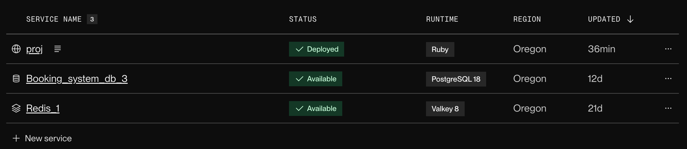

The Chinese University of Hong Kong\
2025-26 Term 2&emsp;CSCI3100 Software Engineering\
Project
# CUHK Venue and Equipment Booking SaaS

## Team Members
| Student ID | Name | GitHub Account |
|---|---|---|
| 1155192671 | Wong Cheuk Yin | [TobiaKW](https://github.com/TobiaKW)
| 1155212047 | Li Yun Sum | [Samuelliys](https://github.com/Samuelliys)
| 1155212592 | Wong Sheung Chit | [jw1101](https://github.com/jw1101)
| 1155213925 | Hsieh Chong Ho | [Qwerty-Pi](https://github.com/Qwerty-Pi)
| 1155214379 | Ng Shing Hin | [Eason2123](https://github.com/Eason2123) (also user nickname "hithub10" is the same commitor)

## Basic Features
| Feature Name | Primary Developer | Secondary Developer | Notes |
|---|---|---|---|
| Deployment & Database | Wong Cheuk Yin | | Render environment setup, maintain the Postgre database in production |
| UI & Styling | Wong Sheung Chit |  | Pure CSS Styling of All Pages |
| User Authentication & Authorization | Wong Cheuk Yin | | Devise gem with admin/user roles |
| Booking Management & Conflict Detection | Wong Cheuk Yin | | Real-time validation, overlap prevention |
| Admin Dashboard & Charts | Wong Cheuk Yin | | Chartkick with Redis caching |
| Testing | Hsieh Chong Ho | Li Yun Sum | Rspec & Cucumber |
| Responsive Layout | Wong Sheung Chit |  | CSS Media Queries |
| Extra Appearance Feature | Wong Sheung Chit |  | Light / Dark Mode, Colour Theme |
| Demo Video | Wong Sheung Chit |  | Recording, Narration & Editing |

## N-1 Advanced Features
| Feature Name | Primary Developer | Secondary Developer | Notes |
|---|---|---|---|
| Real-time Updates | Wong Cheuk Yin | | ActionCable + Redis integration |
| Email Notifications | Wong Cheuk Yin | | Sendgrid Mailer |
| Google Maps Integration | Ng Shing Hin | | Google Map API |
| Resource Search & Filtering | Hsieh Chong Ho | Wong Cheuk Yin | Search by Multiple Criteria, Fuzzy Search |

## Setup Guide

1. Fork this repo

2. Register SendGrid Account and validate your email

3. Register Google Cloud Account and choose Google Maps Platform

   Add a project and the API key will generate automatically, choose **API restriction** and check **Geocoding API, Maps JavaScript API** boxes only.

4. Set up a Redis database and Postgre Database in Render

   To create Redis database, **New → Key Value**, choose the same project of the web deployment. Maxmemory policy choose `noeviction` 

   To create Postgre database, **New → Postgres**, choose the same project of the web deployment. Version=18.

5. Deploy Web service to Render

   Go to [dashboard.render.com](https://dashboard.render.com) and sign in with GitHub.
   **New → Blueprint** , use `render.yaml`
   Connect the forked repo and pick this project.
   Use these settings:
   - **Build Command:** `./bin/render-build.sh`
   - **Start Command:** `bin/rails server -p $PORT -e production`
   - **Environment:**
     - `RAILS_MASTER_KEY` = contents of `config/master.key`
     - `WEB_CONCURRENCY` = `2`
     - `DATABASE_URL` = internal URL of a PostgreSQL database in Render
     - `MAIL_FROM` = the email notification sender (need to setup in SendGrid)
     - `REDIS_URL` = URL of Redis database (for real-time feature)
     - `SMTP_USERNAME` = `apikey`
     - `SMTP_PASSWORD` = API key of the SendGrid account
     - `USE_SENDGRID_HTTP_API` = true
     - `GOOGLE_MAPS_API_KEY` = API key of Google Maps Platform

     If some environment settings are missed, the deployment may fails.
     
6. Click **Create Web Service**. After the build, the app will be at `https://<name>.onrender.com`.

Free plan: app sleeps after ~15 min of no traffic; first request may take 30–60s to wake.
Now the web service is deployed on render via this repository, check deployment.

You shd have the 3 services below on Render:

1. the main web service depolyment
2. Postgre Database
3. Redis Database


## Database PSQL (Only for local)

Connecting

```bash
psql -d proj_development        # connect to DB
\q                              # quit
```

See Structure

```
\dt                             -- list tables
\d users                        -- describe users table (columns, indexes)
\d+ bookings                    -- same, with extra info
```

Basic Enquires

```sql
SELECT * FROM users;            -- all users
SELECT id, email FROM users;    -- specific columns
SELECT * FROM users WHERE email = 'abc@example.com';
SELECT COUNT(*) FROM bookings;  -- how many rows

SELECT id, name, email, role, department_id  FROM users;
```

Update / Insert / Delete rows

```sql
INSERT INTO departments (name) VALUES ('Engineering');

UPDATE users
SET role = 'admin'
WHERE email = 'abc@example.com';

DELETE FROM users
WHERE email = 'abc@example.com';
```

## SimpleCov Report


## Disclaimer
This repository contains academic work and is published for record and reference purposes only. Do not copy or reuse the code as it may constitute academic misconduct. The code is specific to our course project and should be used solely for learning and understanding the concepts. For your own good, please do your project with your own understanding and knowledge. We are not responsible for any academic misconduct caused by the code in this repository.
